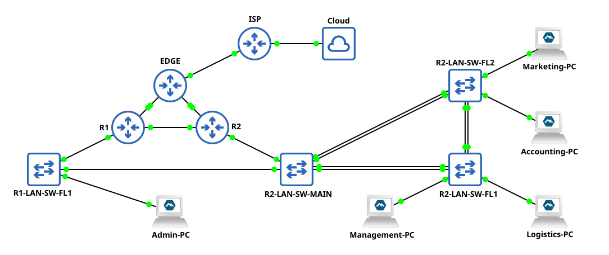

# **ccna-srwe-case-study**

This project uses GNS3 and Cisco Packet Tracer to create a network based
on a case study assigned as the final practical skills assessment for my
CCNA: Switching, Routing, and Wireless Essentials course.
The case study was designed to test skills gained throughout the course and
required that I build and configure a complex network on physical equipment.

## Network Topology



## Skills Demonstrated

* Cisco router and switch configuration
* VLAN and switchport VLAN membership configuration
* EtherChannel configuration
* Static trunking and Dynamic Trunking Protocol (DTP)
* Inter-VLAN routing (router-on-a-stick) configuration
* IPv4 floating static, default, and host routes
* Hot Standby Router Protocol (HSRP) configuration
* Dynamic Host Configuration Protocol (DHCP) pools and scopes
* Switch security, including port security, Dynamic ARP Inspection (DAI),
  PortFast, and BPDU Guard

## Software and Devices Used

### GNS3 Simulation

* GNS3 Server v3.0.5
* GNS3 GUI v3.0.5
* Cisco IOSv Router Appliance (x4)
* Cisco IOSvL2 Switch Appliance (x4)
* Alpine Linux Docker Appliance (x5)
* Cloud Appliance

### Cisco Packet Tracer Simulation

* Cisco Packet Tracer v8.2.2

## Addressing Table

<table>
  <tr>
    <th>Device</th>
    <th>GNS3 Interface</th>
    <th>PT Interface</th>
    <th>IP Address</th>
    <th>Subnet Mask</th>
  </tr>
  <tr>
    <td>ISP</td>
    <td>G0/3</td>
    <td>S0/0/0</td>
    <td>200.1.1.1</td>
    <td>255.255.255.252</td>
  </tr>
  <tr>
    <td rowspan="3">EDGE</td>
    <td>G0/3</td>
    <td>S0/0/0</td>
    <td>200.1.1.2</td>
    <td>255.255.255.252</td>
  </tr>
  <tr>
    <td>G0/0</td>
    <td>G0/0</td>
    <td>192.168.2.1</td>
    <td>255.255.255.252</td>
  </tr>
  <tr>
    <td>G0/1</td>
    <td>G0/1</td>
    <td>192.168.1.1</td>
    <td>255.255.255.252</td>
  </tr>
  <tr>
    <td rowspan="3">R1</td>
    <td>G0/0.10</td>
    <td>G0/0.10</td>
    <td>192.168.10.1</td>
    <td>255.255.255.0</td>
  </tr>
  <tr>
    <td>G0/1</td>
    <td>G0/1</td>
    <td>192.168.1.2</td>
    <td>255.255.255.252</td>
  </tr>
  <tr>
    <td>G0/3</td>
    <td>S0/0/1</td>
    <td>192.168.3.2</td>
    <td>255.255.255.252</td>
  </tr>
  <tr>
    <td rowspan="7">R2</td>
    <td>G0/1</td>
    <td>G0/1</td>
    <td>192.168.2.2</td>
    <td>255.255.255.252</td>
  </tr>
  <tr>
    <td>G0/0.10</td>
    <td>G0/0.10</td>
    <td>192.168.10.2</td>
    <td>255.255.255.0</td>
  </tr>
  <tr>
    <td>G0/0.32</td>
    <td>G0/0.32</td>
    <td>192.168.32.1</td>
    <td>255.255.255.0</td>
  </tr>
  <tr>
    <td>G0/0.36</td>
    <td>G0/0.36</td>
    <td>192.168.36.1</td>
    <td>255.255.255.0</td>
  </tr>
  <tr>
    <td>G0/0.40</td>
    <td>G0/0.40</td>
    <td>192.168.40.1</td>
    <td>255.255.255.0</td>
  </tr>
  <tr>
    <td>G0/0.60</td>
    <td>G0/0.60</td>
    <td>192.168.60.1</td>
    <td>255.255.255.0</td>
  </tr>
  <tr>
    <td>G0/3</td>
    <td>S0/0/0</td>
    <td>192.168.3.1</td>
    <td>255.255.255.252</td>
  </tr>
  <tr>
    <td>HSRP</td>
    <td colspan="2">Virtual Gateway for R1 and R2</td>
    <td>192.168.10.3</td>
    <td>255.255.255.0</td>
  </tr>
  <tr>
    <td>R1-LAN-SW-FL1</td>
    <td colspan="2">Switched Virtual Interface (SVI)</td>
    <td>192.168.10.4</td>
    <td>255.255.255.0</td>
  </tr>
  <tr>
    <td>R2-LAN-SW-MAIN</td>
    <td colspan="2">Switched Virtual Interface (SVI)</td>
    <td>192.168.60.4</td>
    <td>255.255.255.0</td>
  </tr>
  <tr>
    <td>R2-LAN-SW-FL1</td>
    <td colspan="2">Switched Virtual Interface (SVI)</td>
    <td>192.168.60.5</td>
    <td>255.255.255.0</td>
  </tr>
  <tr>
    <td>R2-LAN-SW-FL2</td>
    <td colspan="2">Switched Virtual Interface (SVI)</td>
    <td>192.168.60.6</td>
    <td>255.255.255.0</td>
  </tr>
  <tr>
    <td>Admin-PC</td>
    <td colspan="2">eth0 Network Interface</td>
    <td>192.168.10.10</td>
    <td>255.255.255.0</td>
  </tr>
  <tr>
    <td>Accounting-PC</td>
    <td colspan="2">eth0 Network Interface</td>
    <td colspan="2">DHCP Pool R2-VLAN-32</td>
  </tr>
  <tr>
    <td>Marketing-PC</td>
    <td colspan="2">eth0 Network Interface</td>
    <td colspan="2">DHCP Pool R2-VLAN-36</td>
  </tr>
  <tr>
    <td>Logistics-PC</td>
    <td colspan="2">eth0 Network Interface</td>
    <td colspan="2">DHCP Pool R2-VLAN-40</td>
  </tr>
  <tr>
    <td>Management-PC</td>
    <td colspan="2">eth0 Network Interface</td>
    <td colspan="2">DHCP Pool R2-VLAN-60</td>
  </tr>
</table>

## Router Configuration

### Basic Router Configuration

* Set header MOTD message with this project info
* Set encrypted console/privileged EXEC passwords (cisco123)
* Configured remote access to the VTY lines
* Configured interface addressing per Addressing Table
* Activated used interfaces only

### Special Router Configuration

* Configured inter-VLAN routing on R2 for all R2 switches
* Configured HSRP for VLAN 10 only with priority and preempt given to R1
* Configured EDGE router as DHCP server
* Created DHCP pool for each VLAN

### Route Configuration

<details open>

<summary>EDGE Routes</summary>

* Default route via G0/3 (Packet Tracer: S0/0/0)
* Static route for 192.168.10.0/24 set to 192.168.1.2
* Floating static route for 192.168.10.0/24 set to 192.168.2.2 with AD of 10
* Static route for 192.168.32.0/19 set to 192.168.2.2
* Floating static route for 192.168.32.0/19 set to 192.168.1.2 with AD of 10

</details>

<details open>

<summary>R1 Routes</summary>

* Default route via G0/1
* Floating default route via G0/3 (Packet Tracer: S0/0/0) with AD of 10
* Summarized static route to R2 VLANs

</details>

<details open>

<summary>R2 Routes</summary>

* Default route via G0/1
* Floating default via G0/3 (Packet Tracer: S0/0/0) with AD of 10
* Summarized static route to R1 VLAN

</details>

## Switch Configuration

### Basic Switch Configuration

* Set header MOTD message with this project info
* Set encrypted console/privileged EXEC passwords (cisco123)
* Configured remote access to the switch SVI (SSH only)
* Configured interface addressing per Addressing Table
* Implemented best practices for all unused switchports
* Activated used interfaces only

### VLAN Configuration

<details open>

<summary>VLAN Information</summary>

| VLAN | Name       | IP Network   | Subnet Mask   |
| ---- | ---------- | ------------ | ------------- |
| 10   | Admin      | 192.168.10.0 | 255.255.255.0 |
| 32   | Accounting | 192.168.32.0 | 255.255.255.0 |
| 36   | Marketing  | 192.168.36.0 | 255.255.255.0 |
| 40   | Logistics  | 192.168.40.0 | 255.255.255.0 |
| 60   | Management | 192.168.60.0 | 255.255.255.0 |

</details>

<details open>

<summary>Port Assignment</summary>

<table>
  <tr>
    <th>Device</th>
    <th>VLAN</th>
    <th>VLAN Name</th>
    <th>GNS3 Ports</th>
    <th>PacketTracer Ports</th>
  </tr>
  <tr>
    <td rowspan="4">R2-LAN-MAIN-SW</td>
    <td>32</td>
    <td>Accounting</td>
    <td>G0/0-1</td>
    <td>F0/1-5</td>
  </tr>
  <tr>
    <td>36</td>
    <td>Marketing</td>
    <td>G0/2-3</td>
    <td>F0/6-10</td>
  </tr>
  <tr>
    <td>40</td>
    <td>Logistics</td>
    <td>G1/0-1</td>
    <td>F0/11-15</td>
  </tr>
  <tr>
    <td>60</td>
    <td>Management Native</td>
    <td>G1/2-3</td>
    <td>F0/16-19</td>
  </tr>
  <tr>
    <td rowspan="3">R2-LAN-SW-FL1</td>
    <td>36</td>
    <td>Marketing</td>
    <td>G0/2-3</td>
    <td>F0/7-10</td>
  </tr>
  <tr>
    <td>40</td>
    <td>Logistics</td>
    <td>G1/0-1</td>
    <td>F0/11-15</td>
  </tr>
  <tr>
    <td>60</td>
    <td>Management Native</td>
    <td>G1/2-3</td>
    <td>F0/16-19</td>
  </tr>
  <tr>
    <td rowspan="4">R2-LAN-SW-FL2</td>
    <td>32</td>
    <td>Accounting</td>
    <td>G0/0-1</td>
    <td>F0/1-5</td>
  </tr>
  <tr>
    <td>36</td>
    <td>Marketing</td>
    <td>G0/2-3</td>
    <td>F0/6-10</td>
  </tr>
  <tr>
    <td>40</td>
    <td>Logistics</td>
    <td>G1/0-1</td>
    <td>F0/11-15</td>
  </tr>
  <tr>
    <td>60</td>
    <td>Management Native</td>
    <td>G1/2-3</td>
    <td>F0/19</td>
  </tr>
</table>

</details>

### Special Switch Configuration

<details open>

<summary>EtherChannel Information</summary>

<table>
  <tr>
    <th>Channel Group</th>
    <th>Devices in Group</th>
    <th>GNS3 Ports</th>
    <th>PacketTracer Ports</th>
  </tr>
  <tr>
    <td rowspan="2">Port Channel 1</td>
    <td>R2-LAN-MAIN-SW</td>
    <td>G3/2, G3/3</td>
    <td>F0/23, F0/24</td>
  </tr>
  <tr>
    <td>R2-LAN-SW-FL1</td>
    <td>G3/2, G3/3</td>
    <td>F0/23, F0/24</td>
  </tr>
  <tr>
    <td rowspan="2">Port Channel 2</td>
    <td>R2-LAN-MAIN-SW</td>
    <td>G3/0, G3/1</td>
    <td>F0/21, F0/22</td>
  </tr>
  <tr>
    <td>R2-LAN-SW-FL2</td>
    <td>G3/0, G3/1</td>
    <td>F0/21, F0/22</td>
  </tr>
  <tr>
    <td rowspan="2">Port Channel 3</td>
    <td>R2-LAN-SW-FL1</td>
    <td>G3/0, G3/1</td>
    <td>F0/21, F0/22</td>
  </tr>
  <tr>
    <td>R2-LAN-SW-FL2</td>
    <td>G3/2, G3/3</td>
    <td>F0/23, F0/24</td>
  </tr>
</table>

</details>

#### EtherChannel Configuration

* Created EtherChannels using Cisco LACP protocol
* Configured the port channel interfaces as static trunks
* Configured R2-LAN-MAIN-SW with static trunk to R2
* Set Management VLAN as the native VLAN on all switches
* Disabled DTP negotiation

#### STP Configuration

* Set R1-LAN-SW-FL1 as root for VLAN 10
* Set R2-LAN-SW-MAIN as the root for all other VLANs

#### Switch Security Configuration

* Enabled PortFast and BPDU Guard on active ports
* Set port security on active ports:
  - Accept a maximum of 4 MAC addresses
  - On violation, drop frames, log it, and send alert
  - Aging time of 10 minutes
  - Sticky MAC address learning
* Activated Dynamic ARP Inspection (DAI) globally
* Configure links to router as trusted

## GNS3 Alpine Linux Configuration

Configured host names:
```
echo "HOSTNAME" > /etc/hostname
hostname -F /etc/hostname
```

Configured `/etc/network/interfaces` for DHCP hosts:
```
auto eth0
iface eth0 inet dhcp
```

Configured `/etc/network/interfaces` for `Admin-PC`:
```
auto eth0
iface eth0 inet static
address 192.168.10.10
netmask 255.255.255.0
gateway 192.168.10.1
```

Configured `/etc/resolv.conf` for `Admin-PC`:
```
nameserver 8.8.8.8
```

## Deliverables

**The original case study required the following deliverables:**

* Provide configurations from all devices
* Demonstrate connectivity from all hosts
* Demonstrate the floating static default route is working:
  - Send an extended ping from Admin-PC to a remote site
  - Administratively shut down the link on R2 G0/1
  - The extended ping should continue with few dropped packets
* Demonstrate HSRP functionality:
  - Run a traceroute from Admin-PC to the ISP router
  - Administratively shut down the link on R1 G0/0
  - Rerun the traceroute and confirm the path uses R2

## License

GNU General Public License v3.0
